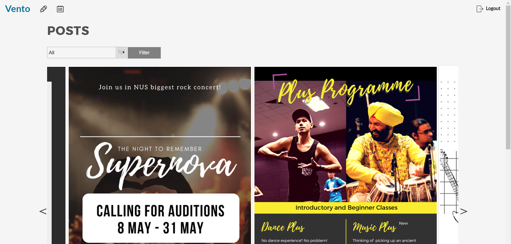
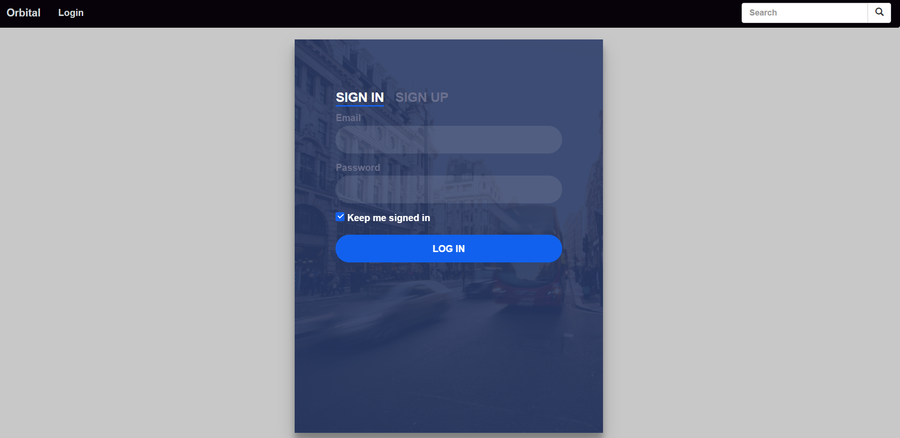
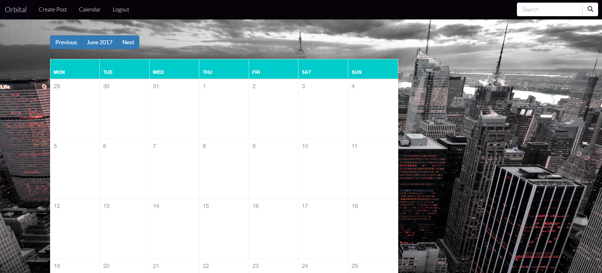

# README

## Project Scope
Web app to allow users to view and create events, and save them to a planner

A web app designed to allows users to sign up for current events as well as discover upcoming events . Users can also host their own events and invite others via social media. The app updates with real time to ensure that all events are updated.

## Problem motivation
Students looking to get in touch with the latest happenings will now have a one-stop shop with listings of all events happening. No longer will they need to trawl through multiple websites and look through obscure listings. Users can also send invites via social media platforms to coordinate with other like-minded individuals. Up-and-coming events now have a platform to showcase their offerings and boost their presence.

## Proposed Features and Technologies 

The web app will be designed and built using Ruby on Rails, to take advantage of the large number of gems, such as bcrypt, carrierwave, paginator that are used in the app.

-Users can create accounts and log in to manage their events, using Postgresql as the backend to manage all CRUD activities

-Able to post new events

-Able to save events to their calendar

-Link to social media accounts, mailer functions and linking to google calendar in the future

Level of Achievement: Gemini

## Project Log

| S/N | Task | Date | Rachael | Thomas | Remarks |
| --- | --- | --- | --- | --- | --- |
| 1 | Liftoff Day 1 | 8 May 2017 | 8 | 8 | Overview of Mobile App Development & Basic Android App Development |
| 2 | Liftoff Day 2 | 9 May 2017 | 8 | 8 | Intermediate Android App Development, An introduction to Serverless codes on Windows Azure and Git |
| 3 | Team meeting & planning | 16 May 2017 | 10 | 10 | Planning of idea execution for the project and technology required |
| 4 | Learning of technology used | 20 May 2017 | 10 | 10 | Ruby on Rails, Postgresql, HTML, CSS, JavaScript, HAML |
| 5 | Learning of technology used | 22 May 2017 | 10 | 10 | Ruby on Rails, Postgresql, HTML, CSS, JavaScript, HAML |
| 6 | Implementation details and initial project structure | 20 May 2017 | 10 | 10 | Discussion of the specific implementation of features |
| 7 | Mission Control | 19 May 2017 | 5 | 5 | MeteorJS Workshop |
| 8 | Team meeting & planning | 25 May 2017 | 10 | 10 | Continuation of ideation |
| 9 | Mission Control | 10 Jun 2017 | 6 | 6 | Web Security Workshop and Google Workshop on BigQuery |
| 10 | Programming | 29 May 2017 | 10 | 10 | Working on Frontend |
| 11 | Programming | 5 Jun 2017 | 5 | 5 | Working on UI |
| 12 | Programming | 7 Jun 2017 | 7 | 7 | Working on UI |
| 13 | Programming | 10 Jun 2017 | 10 | 10 | Develop database and filtering |
| 14 | Programming | 12 Jun 2017 | 10 | 10 | Working on Backend |
| 15 | Programming | 15 Jun 2017 | 10 | 10 | Working on Backend |
| 16 | Programming | 18 Jun 2017 | 6 | 6 | Debugging |
| 17 | Team meeting | 25 Jun 2017 | 10 | 10 | Worked on Milestones |

| Total Hours | Rachael | Thomas |
| --- | --- | --- |
| 280 | 140 | 140 |

