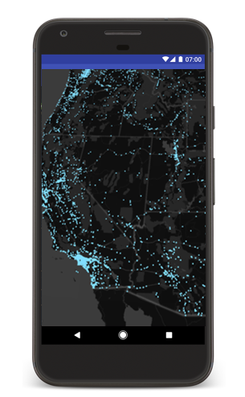
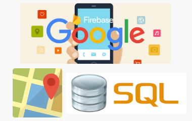

# README

## Project Scope
Mobile app to allow users to view, locate and create events on a map

A map-based mobile app designed to allows users to sign up for current events as well as discover upcoming events based on several criteria such as their interests and location. Users can also host their own events and invite others. The app updates with real time to ensure that all events are updated.

## Problem motivation
Enthusiasts looking to get in touch with the latest happenings will now have a one-stop shop with listings of all events happening. No longer will they need to trawl through multiple websites and look through obscure listings. Users can also send invites through the app to coordinate with other like-minded individuals. Up-and-coming events now have a platform to showcase their offerings and boost their presence.

## Proposed Features and Technologies 

- Users will be able to sign up and maintain accounts with the use of Google Firebase
- Use of Google Maps or other maps API will be the mainstay of the app | to allow geo-mapping of events
- Events can be filtered at the user's request 
- Front-end will be built using React and React-Native

Level of Achievement: Gemini

## Project Log

| Task | Date | Rachael | Thomas | Remarks |
| --- | --- | --- | --- | --- |
| 1 | Liftoff Day 1 | 8 May 2017 | 8 | 8 | Overview of Mobile App Development & Basic Android App Development |
| 2 | Liftoff Day 2 | 9 May 2017 | 8 | 8 | Intermediate Android App Development, An introduction to Serverless codes on Windows Azure and Git |
| 3 | Team meeting & planning | 16 May 2017 | 10 | 10 | Planning of idea execution for the project and technology required |
| 4 | Learning of technology used | 20 May 2017 | 10 | 10 | React, JSX, SQL database and Android Dev |
| 5 | Learning of technology used | 22 May 2017 | 10 | 10 | React, JSX, SQL database and Android Dev 2 |
| 6 | Implementation details and initial project structure | 20 May 2017 | 10 | 10 | Discussion of the specific implementation of features |
| 7 | Mission Control | 19 May 2017 | 5 | 5 | MeteorJS Workshop |
| 8 | Team meeting & planning | 25 May 2017 | 10 | 10 | Continuation of ideation |
| 9 | Mission Control | 10 Jun 2017 | 6 | 6 | Web Security Workshop and Google Workshop on BigQuery |
| 10 | Programming | 29 May 2017 | 10 | 10 | Working on Frontend |
| 11 | Programming | 5 Jun 2017 | 5 | 5 | Working on UI |
| 12 | Programming | 7 Jun 2017 | 7 | 7 | Working on UI 2 |
| 13 | Programming | 12 Jun 2017 | 10 | 10 | Develop database and filtering |
| 14 | Programming | 18 Jun 2017 | 10 | 10 | Working on Backend |
| 15 | Programming | 24 Jun 2017 | 10 | 10 | Working on Backend |
| 16 | Programming | 26 Jun 2017 | 6 | 6 | Debugging |
| 17 | Team meeting | 8 Aug 2017 | 10 | 10 | Worked on Milestones |
| --- | --- | --- | --- | --- |

| Total Hours | Rachael | Thomas |
| 280 | 140 | 140 |
| - | - | - |

